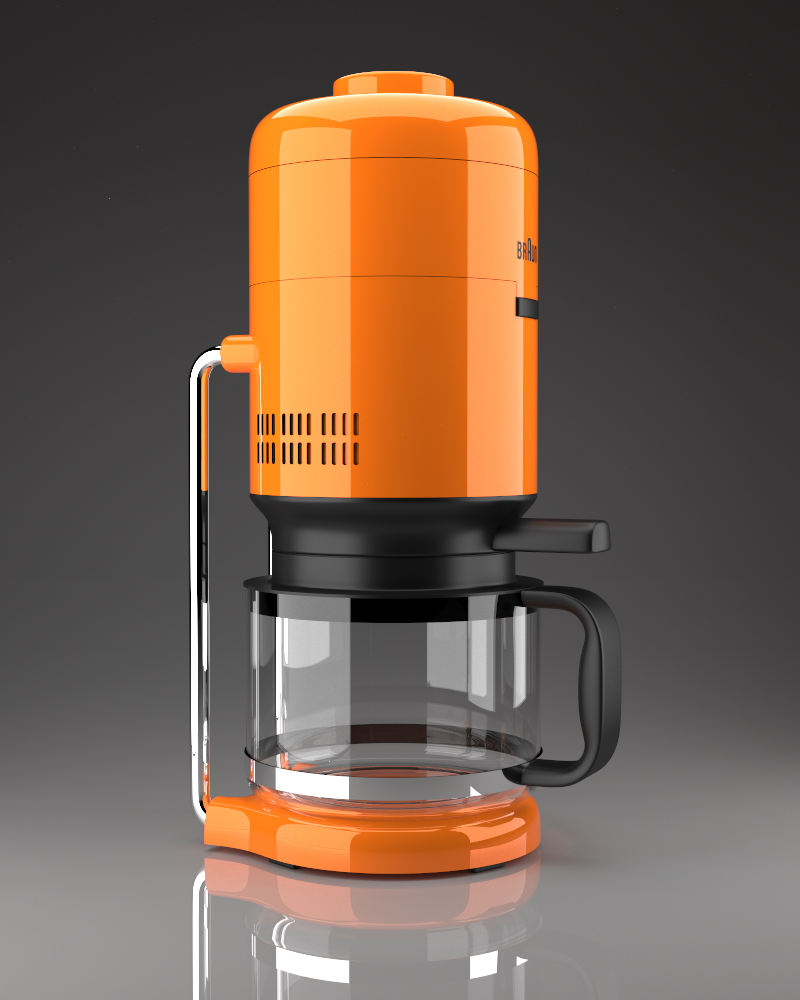
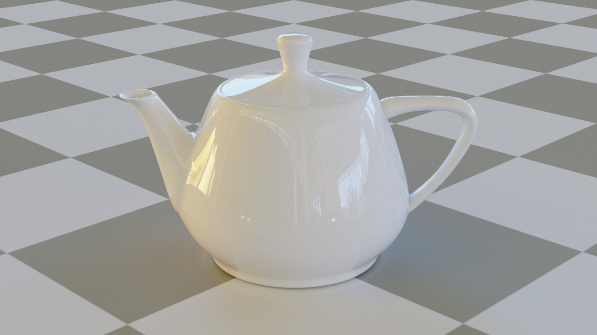
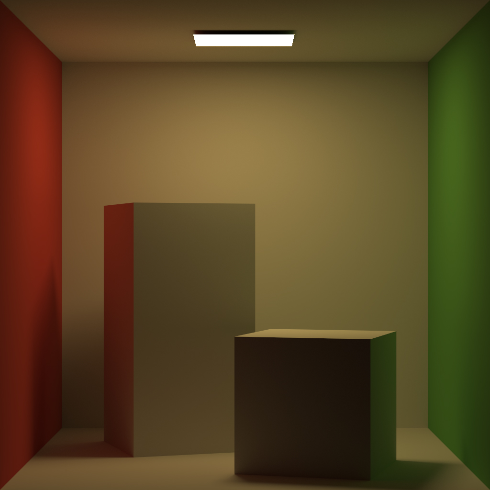
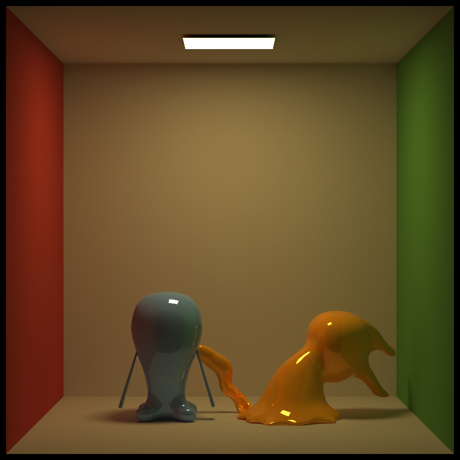
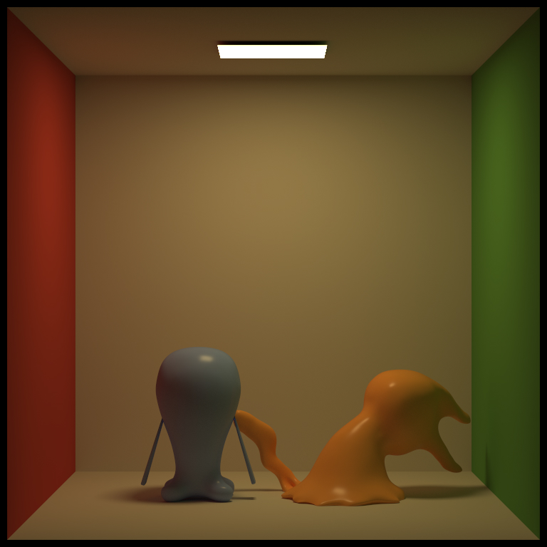
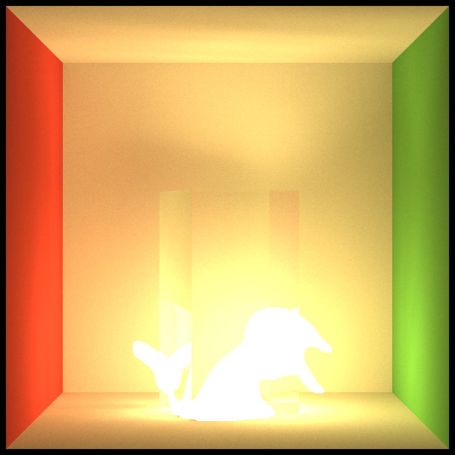

# GPUSpectral
Path tracer powered by Vulkan Ray Tracing api.

## Features
- Vulkan abstraction with handles
- Vulkan render graph with fully automatic barriers
- Physically based path tracer with support for all common bsdfs

## Images

